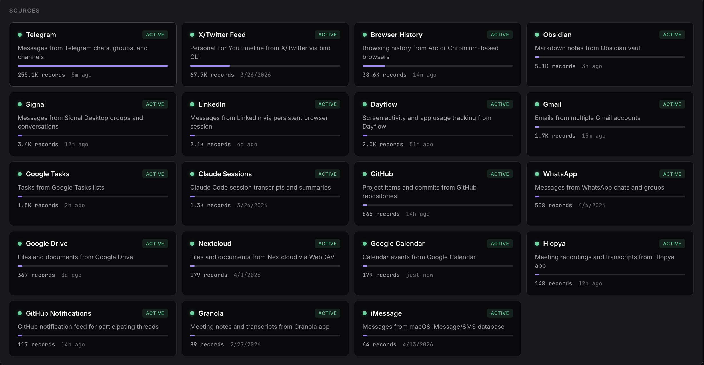

# vadimgest

Your digital life in one place. Syncs messages, emails, meetings, notes, browsing history, and code sessions from 19 sources into a single searchable archive.

No cloud. No subscriptions. Everything stays on your machine.



> Works standalone or as the data layer for [Klava](https://github.com/VCasecnikovs/klava) - a personal AI assistant built on Claude Code that reads vadimgest to keep itself aware of what's happening in your world. Blog post about the whole stack: [link](#todo-link-to-blog) _(ToDo)_.

## What it does

vadimgest pulls data from the tools you already use and stores it locally as append-only JSONL files. A built-in search index lets you find anything across all sources instantly.

**19 sources supported:**

| Messages | Productivity | Code & Work | Media |
|----------|-------------|-------------|-------|
| Telegram | Gmail | GitHub Issues | Browser History |
| Signal | Google Calendar | GitHub Notifications | X / Twitter |
| WhatsApp | Google Tasks | Claude Sessions | LinkedIn |
| iMessage | Google Drive | Obsidian Notes | |
| | Nextcloud | Granola Meetings | |
| | | Dayflow Activity | |
| | | Hlopya Meetings | |

## Quick start

```bash
pip install -e ".[all]"

# Launch the dashboard
vadimgest serve --port 8484
```

Open [localhost:8484](http://localhost:8484) - the setup wizard walks you through enabling sources, installing dependencies, and authenticating accounts. Everything happens in the browser, no terminal needed.

Or use the CLI directly:

```bash
vadimgest list                       # see available sources
vadimgest sync                       # sync all enabled sources
vadimgest stats                      # record counts
vadimgest search "query" --md --raw  # search everything
```

## Dashboard

The web dashboard gives you a full overview of your data and lets you manage sources without touching config files.


- **Source grid** with live status, record counts, and last sync times
- **Setup wizard** - guided onboarding that installs dependencies and handles auth
- **Source drawers** - configure each source, view setup checklists, trigger syncs
- **Full-text search** across all sources with filters
- **Background sync daemon** with health monitoring

## Running in the background

vadimgest has two long-running processes:

- **Dashboard** (`vadimgest serve`) - web UI on port 8484
- **Sync daemon** (`vadimgest daemon`) - syncs all enabled sources every 5 minutes

### One command setup

```bash
vadimgest autostart
```

This installs both as system services (launchd on macOS, systemd on Linux) that start on boot, restart on crash, and run in the background. Done.

```
Installed and started: com.vadimgest.dashboard
Installed and started: com.vadimgest.daemon

Dashboard: http://localhost:8484
Daemon: syncing every 300s
Logs: /tmp/vadimgest-dashboard.log, /tmp/vadimgest-daemon.log
```

Options:

```bash
vadimgest autostart                    # install and start
vadimgest autostart --port 9090        # custom dashboard port
vadimgest autostart --interval 600     # sync every 10 minutes
vadimgest autostart --disable          # stop and remove
```

### Manual start

If you prefer running them yourself:

```bash
vadimgest serve --no-open --port 8484 &
vadimgest daemon --interval 300 &
```

## Search

Full-text search over all your data using SQLite FTS5. The index builds automatically on first search.

```bash
# Search everything
vadimgest search "meeting notes" --md --raw

# Search specific sources
vadimgest search "contract" -s telegram
vadimgest search "quarterly review" -s gmail

# Filter by chat or folder
vadimgest search "deadline" --raw --chat "Alice"
vadimgest search "architecture" --md --folder "Projects"

# Output options
vadimgest search "query" --raw -n 50       # more results
vadimgest search "query" --md --full       # full content
vadimgest search "query" --raw --json      # JSON for piping
```

**Scope flags** (at least one required):

| Flag | Searches |
|------|----------|
| `--md` | Obsidian vault |
| `--raw` | All JSONL sources |
| `--md --raw` | Everything |
| `-s SOURCE` | One specific source |

## CLI reference

```bash
vadimgest sync                       # sync all enabled
vadimgest sync signal granola        # sync specific sources
vadimgest list                       # sources + availability
vadimgest stats                      # record counts per source
vadimgest health                     # health check + recent errors
vadimgest doctor                     # dependency check
vadimgest read -c NAME               # read new records (consumer API)
vadimgest commit -c NAME             # advance consumer checkpoint
vadimgest search "query" --md --raw  # full-text search
vadimgest search index               # rebuild search index
vadimgest serve --port 8484          # start dashboard
vadimgest init                       # create config from template
vadimgest config                     # show effective config
```

## Configuration

Config is loaded from (in order):
1. `$VADIMGEST_CONFIG` env var
2. `~/.config/vadimgest/config.yaml` (XDG)
3. `~/.vadimgest/config.yaml` (user dotfolder, canonical)
4. `./config.yaml` next to the package (legacy)

Secrets (API keys, tokens) live in a `.env` file alongside `config.yaml` — never commit this file.

### Telegram credentials

Telegram requires your own `api_id` and `api_hash`. Register an app at <https://my.telegram.org/apps> (free, takes a minute) and put the values in `.env`:

```
TELEGRAM_API_ID=...
TELEGRAM_API_HASH=...
```

Do not use someone else's credentials — Telegram rate-limits per-app, and misuse can get the app banned.

```yaml
telegram:
  enabled: true
  monitored_folders: [Work, Friends]
  max_messages_per_chat: 500

signal:
  enabled: true

obsidian:
  enabled: true
  vault_path: ~/Documents/MyVault

gmail:
  enabled: true
```

Run `vadimgest init` to generate a config file from the template, or use the dashboard wizard to configure everything visually.

## External dependencies

Some sources need external CLI tools. The dashboard can install these for you, or do it manually:

```bash
# Google services (Gmail, Calendar, Drive, Tasks)
brew install gogcli

# WhatsApp
brew install steipete/tap/wacli

# Signal Desktop
brew install tbvdm/tap/sigtop

# GitHub
brew install gh

# X / Twitter
npm i -g @steipete/bird

# LinkedIn (headless browser)
pip install playwright && playwright install chromium
```

## How it works

```
Sources          vadimgest sync          Storage            Search
 Telegram   -->                    -->  JSONL files   -->  SQLite FTS5
 Signal     -->    19 syncers          (append-only)      350K+ docs
 Gmail      -->    cron / daemon        one per source     <50ms queries
 ...19 total -->                   -->                -->
```

Each source has a syncer that knows how to pull new data. Syncers run on a schedule (cron mode) or continuously (daemon mode). Data is written as append-only JSONL - records are never modified or deleted.

The search index is a SQLite FTS5 database that indexes both JSONL records and Obsidian markdown files. Incremental updates take under a second.

## Consumer API

Build scripts that process vadimgest data with checkpoint tracking:

```python
from vadimgest.store import DataStore

store = DataStore("~/.local/share/vadimgest")

# Read new records since last checkpoint
for record in store.read_new("signal", consumer="my-bot"):
    process(record)

# Advance checkpoint
store.commit("signal", consumer="my-bot")
```

## Adding a new source

```python
# ingest/sources/newsource/syncer.py
from ..base import CronSyncer

class NewSourceSyncer(CronSyncer):
    source_name = "newsource"

    def fetch_new(self, state, limit=1000):
        for item in get_data():
            yield {"id": item.id, "type": "document", "title": item.title, "content": item.body}
```

Register it in `ingest/sources/__init__.py`, add defaults in `config.py`, and the search indexer picks it up automatically.

## Data format

All records are stored as JSONL in `data/sources/<source>.jsonl`:

```json
{"_source": "telegram", "_ingested_at": "2026-04-17T12:00:00", "id": "msg_42", "type": "conversation", "chat": "Alice", "messages": [...]}
{"_source": "gmail", "_ingested_at": "2026-04-17T12:01:00", "id": "email_99", "type": "email", "subject": "Q2 Review", "from": "bob@example.com"}
```

Records are append-only. Each source gets its own file. Checkpoints track what's been processed.

## License

MIT - see [LICENSE](LICENSE).
